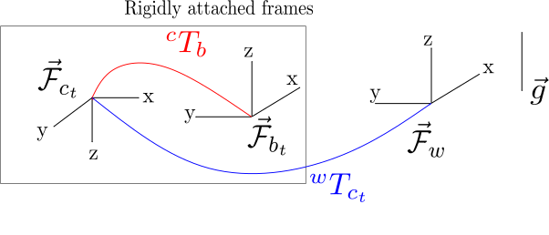

# Hawk

## Contents
- [Setup](#setup)
- [Transformations](#transforms)
- [Naming conventions](#conventions)
- [Launch files](#launch)
- [Run ROS over network](#network)
- [Important PX4 PARAMS](px4)

<a name="setup"></a>
## Setup

### Clone

```bash
cd ~
git clone git@github.com:kvmanohar22/hawk.git hawk_ws
```

### Install dependencies

- Ubuntu setup
  - Set the environment variable `HAWK_PX4_FIRMWARE` to the source of `px4/Firmware` in `scripts/load_px4_firmware`.
  - Copy the file `99-pixhawk.rules` to the following directory `/etc/udev/rules.d/`.
  - Add yourself to the following groups (reboot required to take effect). This is for enabling offboard communication through serial port.

    ```bash
      sudo usermod -a -G tty <username>
      sudo usermod -a -G dialout <username>
    ```
- Install geographic lib dataset using [this script](https://github.com/mavlink/mavros/blob/master/mavros/scripts/install_geographiclib_datasets.sh). (Requires sudo privileges)

- All the ros dependencies can be installed using `wstool`. Just execute the following command;

  ```bash
    cd ~/hawk_ws/src
    wstool update -j8
  ```

- Install the following dependencies as well
  ```bash
    sudo apt-get install libgoogle-glog-dev libtbb-dev autoconf libyaml-cpp-dev
  ```

- Install MatrixVision driver. Follow the instructions from [here](https://www.matrix-vision.com/manuals/mvBlueFOX/mvBF_page_quickstart.html#mvBF_section_quickstart_linux)

- Install GTSAM as outlined [here](https://github.com/borglab/gtsam). Following changes to be done in `CMakeLists.txt` of GTSAM.
  - **IMPORTANT**: Disable the flag `GTSAM_TANGENT_PREINTEGRATION` which is ON by default.
  - Enable the use of system Eigen (`GTSAM_USE_SYSTEM_EIGEN` should be ON).
  - If you do not want to build tests, examples. Run cmake as follows: `cmake -DGTSAM_BUILD_TESTS=OFF -DGTSAM_BUILD_EXAMPLES_ALWAYS=OFF ..`

- If you are going for minimal ROS installation, following packages are required as well. Replace * in the below package names with `ros-melodic-` or whatever distro you have.
  `*camera-manager *rqt-gui *rqt-gui-py python-catkin-tools`

### Build

**Note:** For the sake of uniformity, use **only** bash shell.

```bash
cd ~/hawk_ws
catkin_make
```

```bash
echo "source devel/setup.bash" >> ~/.bashrc
source ~/.bashrc
```
<a name="conventions"></a>
## Transformations

The following diagram should illustrate the different frames that are presently used in the system.
<div class="fig figcenter fighighlight">
  
</div> 

<a name="conventions"></a>
## Naming conventions
This sections briefly describes the naming conventions for ROS nodes, topics and so on.

- All nodes must fall under the global name `hawk`. eg: for camera_0, `/hawk/camera_0`

### Camera conventions
- Monocular
  - Camera node: `/hawk/camera_0`
  - Raw image data topic: `/hawk/camera_0/image_raw`
- Stereo
  - Camera left node: `/hawk/stereo/left/`
  - Camera right node: `/hawk/stereo/right/`
  - Raw image data for the left camera: `/hawk/stereo/left/image_raw`
  - Raw image data for the right camera: `/hawk/stereo/right/image_raw`

### Misc
- Local bundle adjustment (BA) is controlled via `loba_num_iter` param as opposed to pre-process directive `#USE_BUNDLE_ADJUSTMENT`.
  - Two kinds of BA are supported:
    - BA1: Using normal projection factors from gtsam
    - BA2: Using smart factors from gtsam (computationally more efficient)
  - Specify the parameter `loba_type` to select either. (0 = BA1)

<a name="launch"></a>
## Launch files
- Launch camera node with continuous triggering
  - ```bash
      roslaunch bluefox2 test_continuous_triggering.launch
    ```
  - By default, the images will be published on the topic `/hawk/camera_0/image_raw`
  - To test the second camera, with serial number `26807580`, use the following command;
  - ```bash
      roslaunch bluefox2 test_continuous_triggering.launch device:=26807580
    ```
  - And the images will be published over the same topic

- Launch camera node with hardware triggering enabled
  - ```bash
      roslaunch bluefox2 test_hardware_triggering.launch
    ```
  - Very similar to the previous launch except we also start `mavros` node that publishes image sequence ids
  - Trigger interval has to be specified in QGC
  - Exposure time and other camera specific parameters have to be specified in the launch file
  - **IMPORTANT**: Make sure you have connected FTDI from autopilot to the computer running mavros!

- Launch stereo node with continuous triggering
  - ```bash
      roslaunch bluefox2 test_continuous_triggering_stereo.launch
    ```
  - Images will be published over the topics `/hawk/stereo/left/image_raw` and `/hawk/stereo/right/image_raw`

- Launch stereo node with hardware triggering enabled
  - ```bash
      roslaunch bluefox2 test_hardware_triggering_stereo.launch
    ```
  - Similar to monocular hardware triggering
  - Imu readings will be published over the topic `/mavros/imu/data_raw`
  - Imu data and image data are time synchronized (hardware-level) upto sub-millisecond accuracy

- Visualize camera data from a bagfile
  - For monocular camera,
  - ```bash
      roslaunch svo_ros playback_camera.launch bag_path:=/path/to/bagfile monocular:=true
    ```
  - `bag_path` has to be absolute
  - By default, the topic is `/hawk/camera_0/image_raw`. Pass in the argument through command line if it is a different topic (eg: `image_topic:=/image/topic`)
  - For a stereo camera, use
  - ```bash
      roslaunch svo_ros playback_camera.launch bag_path:=/path/to/bagfile stereo:=true
    ```
  - Additionally set `left_image_topic` and `right_image_topic` params. Defaults to (`/hawk/stereo/left/image_raw` and `/hawk/stereo/right/image_raw` respectively.)

- Run svo from a bagfile
  - ```bash
      roslaunch svo_ros test_hawk_pipeline_bag.launch bag_path:=/path/to/bag
    ```
  - `bag_path` has to be absolute
  - Specify the bag start time using `start:=SEC`. Defaults to 0.
  - **WARNING**: Pass in the right calibration file (`calibration:=/path/to/calibration`)

- Run svo from live camera using continuous triggering
  - ```bash
      roslaunch svo_ros test_hawk_pipeline_live_continuous.launch
    ```
  - Change the exposure in the above launch file
  - **WARNING**: Pass in the right calibration file (`calibration:=/path/to/calibration`)
  - **WARNING**: Set the proper device. Defaults to `camera_1` (`device:=<serial number>`)

- Run svo from live camera using hardware triggering
  - ```bash
      roslaunch svo_ros test_hawk_pipeline_live_hardware.launch
    ```
  - Change the exposure in the above launch file
  - **WARNING**: Pass in the right calibration file (`calibration:=/path/to/calibration`)
  - **WARNING**: Set the proper device. Defaults to `camera_1` (`device:=<serial number>`)

<a name="network"></a>
## Run ROS over network
Super useful when you want to run rviz over PC and other stuff over drone.
1. Edit `/etc/hosts` file on both drone and local PC and add ip addresses as follows
```bash
<ip of onboard device> <username of onboard device>
<ip of local PC 1> <username of local PC 1>
<ip of local PC 2> <username of local PC 2>
...
<ip of local PC N> <username of local PC N>
```
2. change `ROS_MASTER_URI` to the ip address where you want ROS master to run. eg:
```bash
export ROS_MASTER_URI=http://<ip address of host>:11311
export ROS_HOSTNAME=<local username>
```

That's it. You should be able to stream on any device now!

<a name="px4"></a>
## Important PX4 parameters
- For setting up offboard communication:
  - `MAV_1_CONFIG=TELEM2`
  - `MAV_1_MODE=Onboard`
  - `SER_TEL2_BAUD = 921600`
