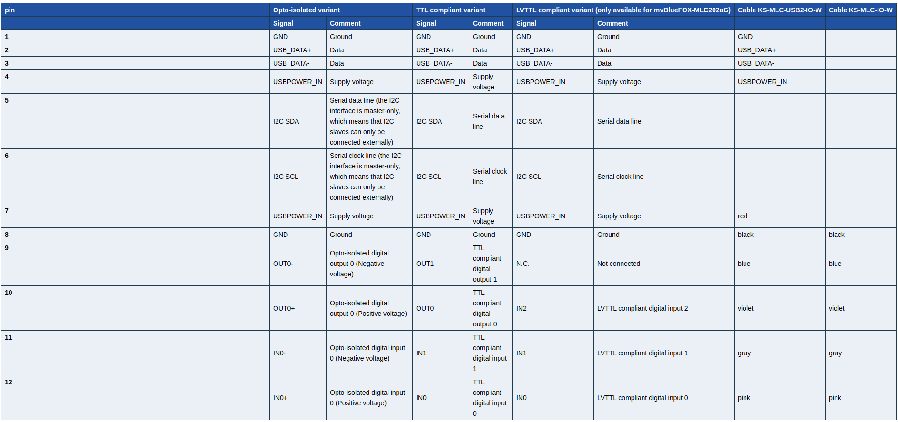

# Camera details

- Specific our camera details: [link](https://www.matrix-vision.com/manuals/mvBlueFOX/CMOS752_section_1_1.html)
- CMOS external triggering guidelines. [link](https://www.matrix-vision.com/manuals/mvBlueFOX/UseCases_section_ExternalTrigger.html) **Pay attention here**. One of the most important things is that, the trigger time should be less than frame time (=exposure time + readout time)

- Different exposure and readout schemes for the camera;

- Following is the I2C bus details used for hardware triggering.

- The input voltage through I2C connector should not exceed 5.5V. If it exceeds use appropriate resistor
- Check this link for more details: [link](https://www.matrix-vision.com/manuals/mvBlueFOX/mvBF_page_tech.html#mvBF_subsubsection_standard_tech_dimensions). This contains for all the cameras, go for MLC.
- Hardware triggering guidelines: [link](https://www.matrix-vision.com/manuals/mvBlueFOX/GUI_page_0.html#GUI_subsubsection_mvPropView_configuring_trigger). In the end of the section in the above link, there is a simple guideline to check if the hardware triggering works as well. Very simple hack. Check that out.
- What does the parameter `set_pixel_clock` do?
- HRTC related details can be found here: [link](https://www.matrix-vision.com/manuals/mvBlueFOX/HRTC_page_0.html)
- Nice tutorials on different use cases are available here: [link](https://www.matrix-vision.com/manuals/mvBlueFOX/UseCases_page_0.html) including multi-camera usage at the same time.
- Some APIs [link](https://www.matrix-vision.com/manuals/mvBlueFOX/page_mvIMPACT_Acquire_SDK.html)
- Just FYI: CMOS sensors with rolling shutter [here](https://www.matrix-vision.com/tl_files/mv11/Glossary/art_rolling_shutter_en.pdf)
- Check this document for hardware triggering: [link](https://docs.px4.io/v1.9.0/en/peripherals/camera.html#camera-trigger)
 
