**Date:** 24/01/2020

**Time:** Around 18:00 hrs

**Location:** Nehru Museum

**Logs:** Logs are located in `logs` directory.

- This is a collated report of two different tests. For a particular comment, the image on the top and bottom correspond to log file 41 and 43 respectively.
- Log file 41 had flight time of 1:48 secs while 43 had flight time of 1:58 secs.

**Note:** Comments 8 & 9 requires further investigation

## Comments
1. Roll Angle and Pitch Angle gains are spot on. These are really good.
   
   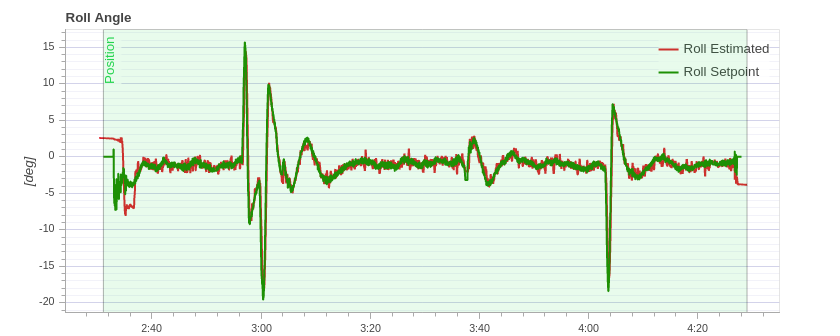
   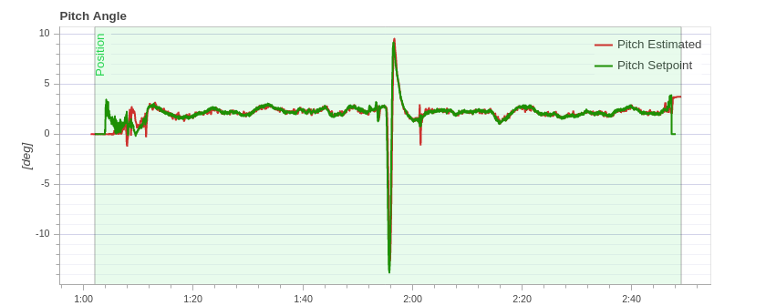
   
2. Angular rates for both roll and pitch have lot of high frequency noise.
   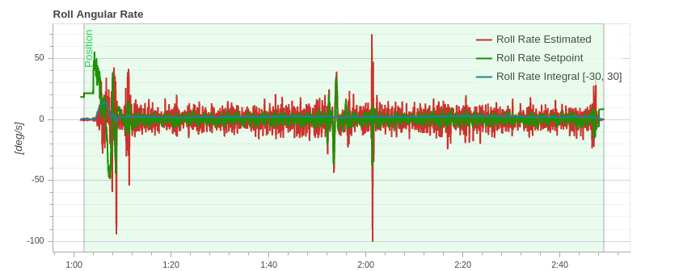
   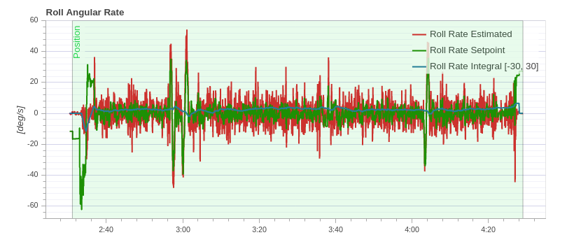
   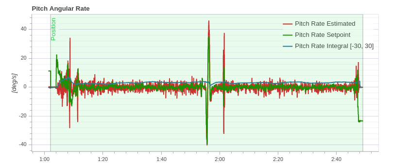
   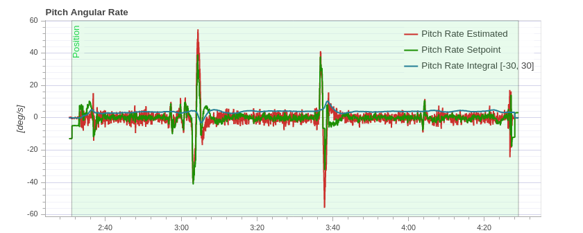
3. Yaw angular gains are good
4. Yaw angular rate gains can be tuned further. They are prematurely stopped from reaching the required setpoints
   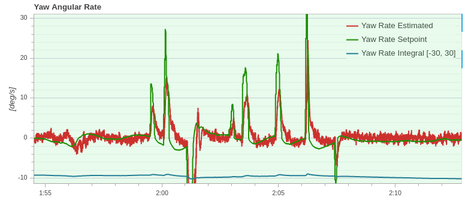
5. XY positional gains are too bad. Lots of overshoot. Settling time is a bit high.
   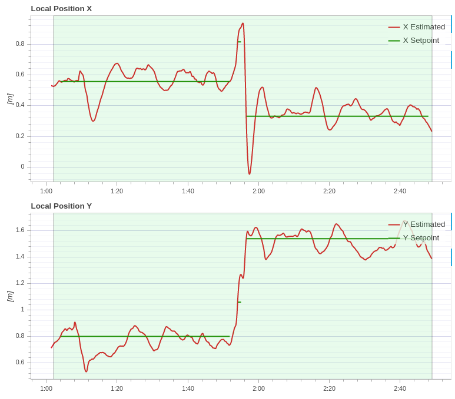
   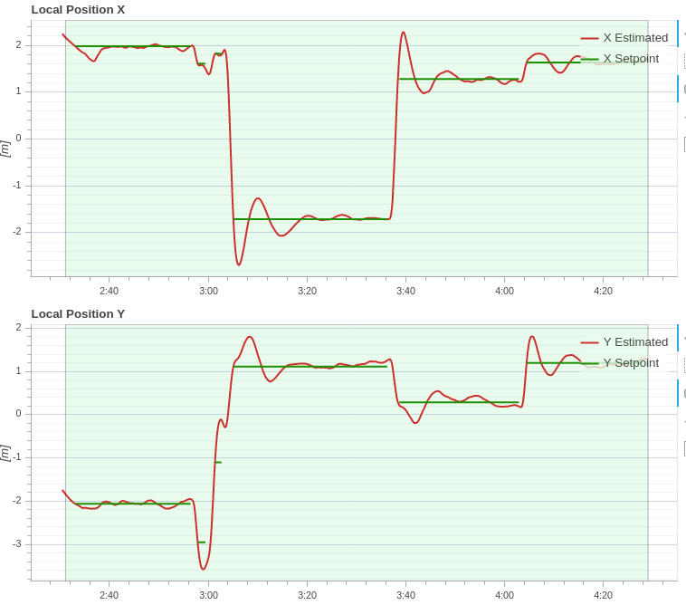
6. Z gains are okay. But require fine tuning.
   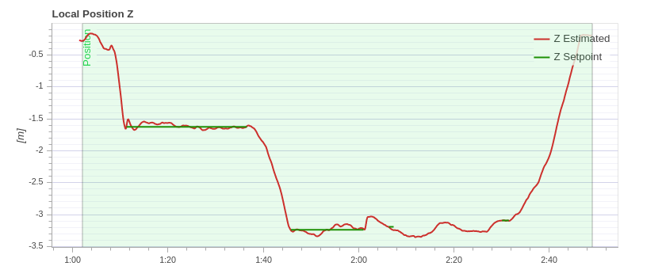
   
7. Similar to yaw angular rate gains, velocity gains can be further fine tuned for both XY and Z.
   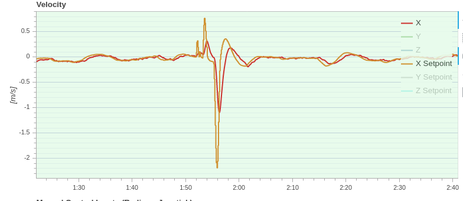
8. Vibration levels are good (less vibration). Much better compared to `01_xxx` logs. What caused lots of vibrations back in the other log and not here? Is it wind? **This requires further investigation.**
   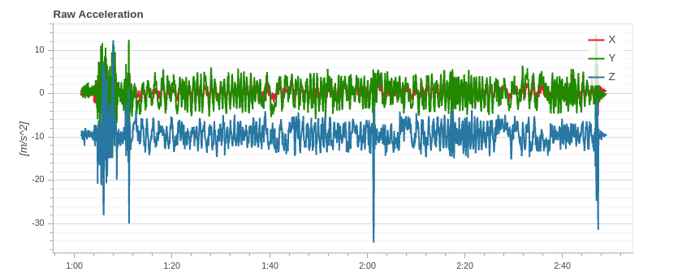
   
   
   
9. Note that on an average, motors 3 and 4 that are diagonally opposite are running at higher RPM => the motors are not well aligned with the horizontal plane. This is observed in both logs 41 and 43 and in `01_xxx` as well. A good test would be just go into positional mode and lock it at that XYZ and verify on an average if PWM output of motors 3 and 4 are higher.
   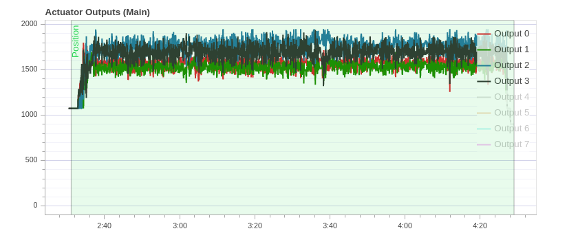