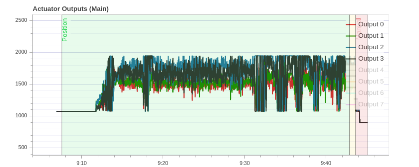
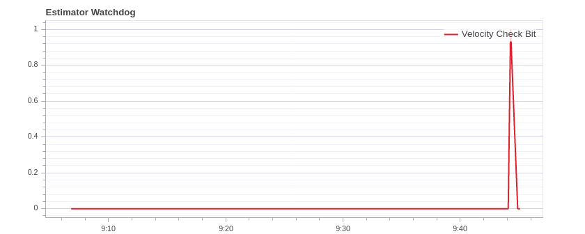

**Date:** 23/01/2020

**Time:** 15:00 to 18:00 hrs

**Location:** Nalanda Complex

## Comments
1. Roll angle, Roll angle rate, Pitch angle, Pitch angle rate seem to be good. There is a slight overshoot in all of the above. But quick response is seen

2. Lot of noise and abrupt changes in yaw angle and yaw angular rate are noticed 
3. Position controllers are way worse. Lot of overshooting is noticed. 
4. Issues with vibration.
    - Actuator Controls FFT (Expected: There should be a single peak below 20Hz at the lowest end of amplitude and the rest should be low and flat).
     
    - Acc. power spectral density graphs (Expected: Lowest part up to a few Hz should be yellow and the rest mostly green or blue)
    
    - Raw Acceleration (Expected: Thin lines and z-axis graph should not touch the x-axis and y-axis graph during hover or slow flight)
     
5. From actuator outputs.
    - It is clear that motors 3 and 4 are running at higher PWM. Maybe one or more motors are tilted or props are deformed. 
    - Weight seems to be balanced since no adjacent motors are running at relatively higher PWM. 
    - Signals are noisy as well likely due to vibrations
    
6. GPS Fix should be 3 but it is 4. Why is that?
7. Estimator watchdog problem. **Velocity Check Bit**. Inspect this further
    

## Resources to refer to
1. Refer this to tune the PID parameters: [https://docs.px4.io/master/en/config_mc/pid_tuning_guide_multicopter.html](https://docs.px4.io/master/en/config_mc/pid_tuning_guide_multicopter.html)
2. When Actuator Controls FFT are as expected refer this guide to increase threshold frequencies. [https://docs.px4.io/master/en/config_mc/racer_setup.html#filters](https://docs.px4.io/master/en/config_mc/racer_setup.html#filters)
3. Vibration isolation refer here: [https://docs.px4.io/master/en/assembly/vibration_isolation.html](https://docs.px4.io/master/en/assembly/vibration_isolation.html)