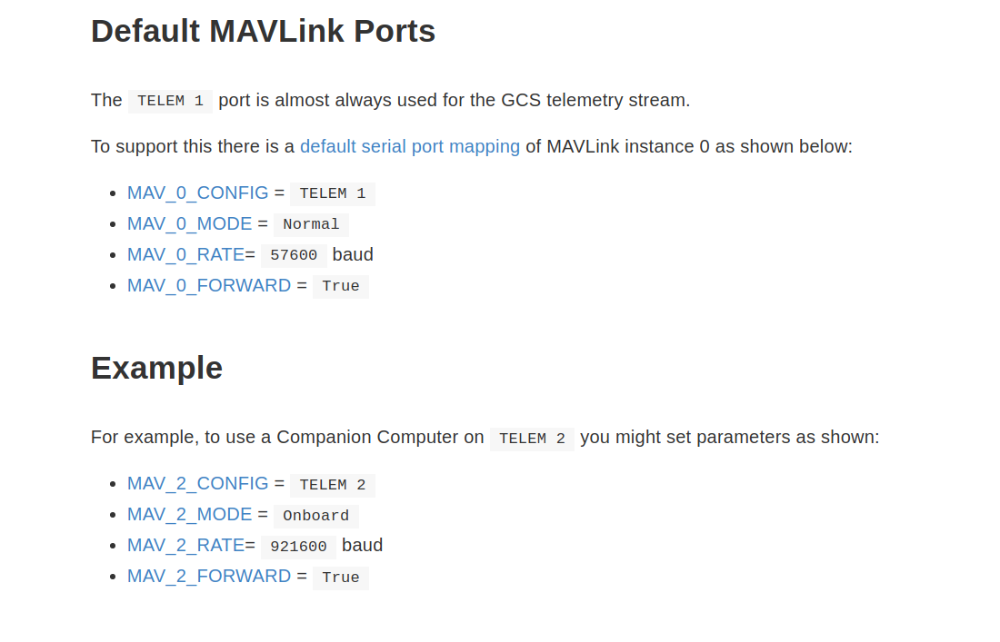
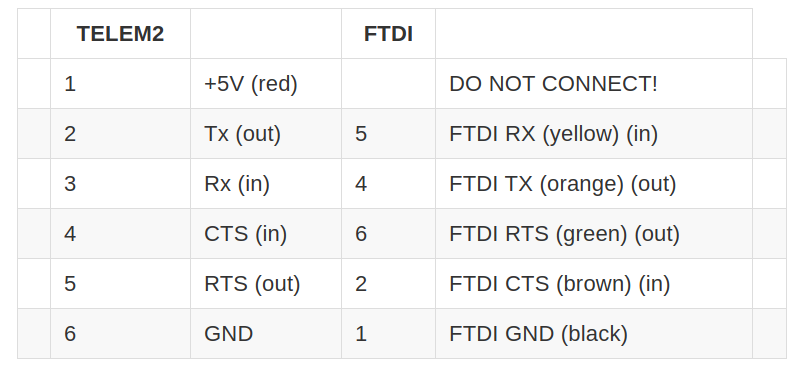

# Offboard
This ROS package contains files to run the offboard flight mode.

## Setup
1. Configure MAVLink parameters using QGC as shown in the following image
  
2. Refer [this guide](https://dev.px4.io/v1.9.0/en/companion_computer/pixhawk_companion.html#hardware-setup) on how to connect (**IMPORTANT**)
  

## Misc details
1. [This](https://ardupilot.org/copter/docs/common-pixhawk-overview.html#common-pixhawk-overview) is detailed overview of each pheripheral on pixhawk
2. Serial port configuration [here](https://docs.px4.io/v1.9.0/en/peripherals/serial_configuration.html)
 
